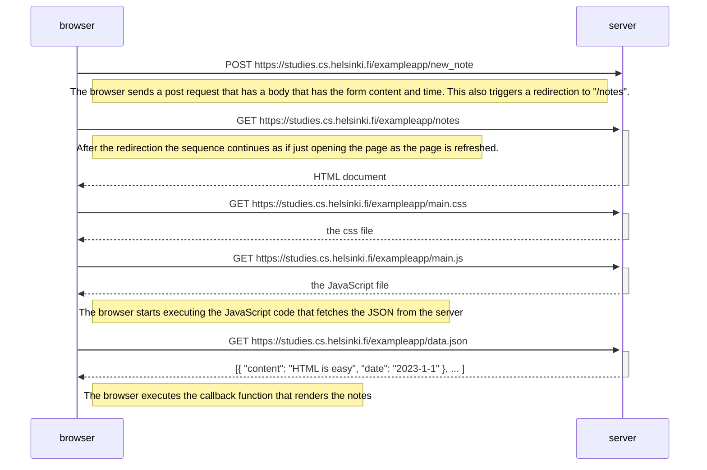

```mermaid
    sequenceDiagram
        participant browser
        participant server
        
        browser->>server: POST https://studies.cs.helsinki.fi/exampleapp/new_note 
        activate server

        Note right of browser: The browser sends a post request that has a body that has the form content and time. This also triggers a redirection to "/notes".

        browser->>server: GET https://studies.cs.helsinki.fi/exampleapp/notes
        activate server

        Note right of browser: After the redirection the sequence continues as if just opening the page as the page is refreshed.

        server-->>browser: HTML document
        deactivate server
        
        browser->>server: GET https://studies.cs.helsinki.fi/exampleapp/main.css
        activate server
        server-->>browser: the css file
        deactivate server
        
        browser->>server: GET https://studies.cs.helsinki.fi/exampleapp/main.js
        activate server
        server-->>browser: the JavaScript file
        deactivate server
        
        Note right of browser: The browser starts executing the JavaScript code that fetches the JSON from the server
        
        browser->>server: GET https://studies.cs.helsinki.fi/exampleapp/data.json
        activate server
        server-->>browser: [{ "content": "HTML is easy", "date": "2023-1-1" }, ... ]
        deactivate server    
        Note right of browser: The browser executes the callback function that renders the notes 
```