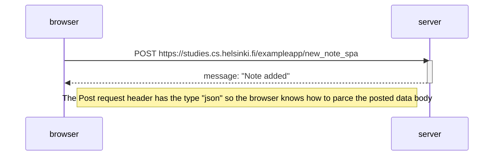

```mermaid
sequenceDiagram

    participant browser
    participant server

    browser->>server: POST https://studies.cs.helsinki.fi/exampleapp/new_note_spa
    activate server
    server-->>browser: message: "Note added"
    deactivate server

    Note right of browser: The Post request header has the type "json" so the browser knows how to parce the posted data body


```